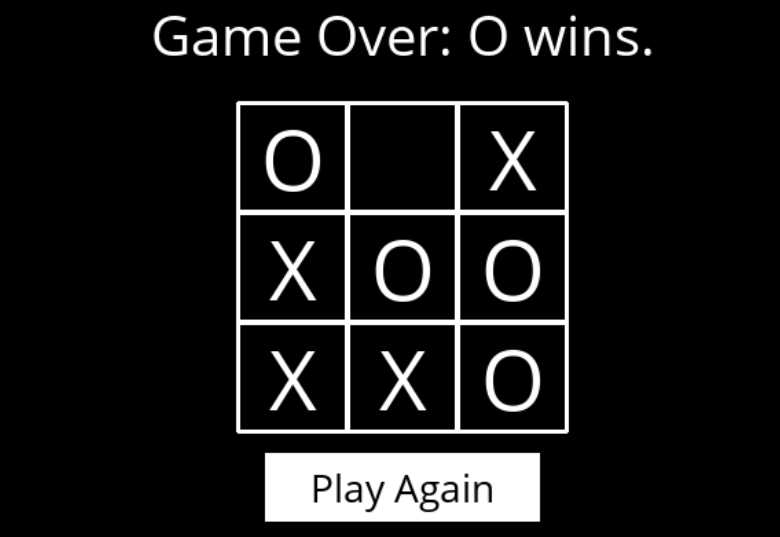
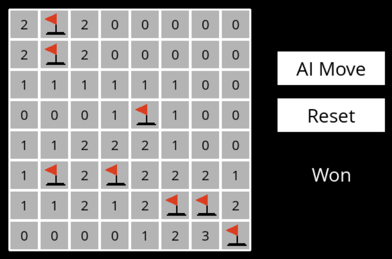
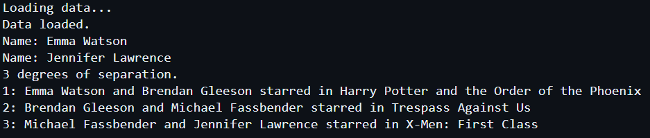
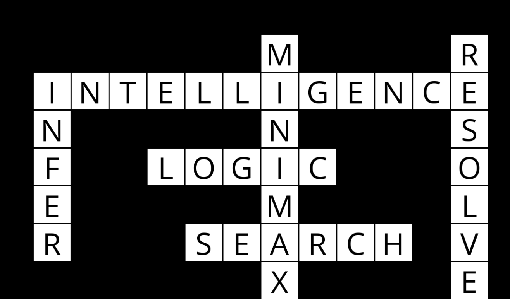

# Projects from CS50's Introduction to Artificial Intelligence with Python

This repository contains projects completed during the CS50's Introduction to Artificial Intelligence with Python course. Below is a list of the projects included:

1. Tic-Tac-Toe AI:
   - An implementation of AI to play Tic-Tac-Toe optimally using the min-max algorithm.
     
    

2. Minesweeper AI:
   - An implementation of AI to play Minesweeper.
     
    

3. Degrees of Separation:
   - A program that determines how many "degrees of separation" apart two actors are using the BFS algorithm.

4. Crossword Puzzle Generator:
   - AI that generates crossword puzzles.

5. Online Shopping Prediction:
   - AI that predicts whether online shopping customers will complete a purchase.

6. Nim AI:
   - AI that teaches itself to play Nim through reinforcement learning.

And other projects.
